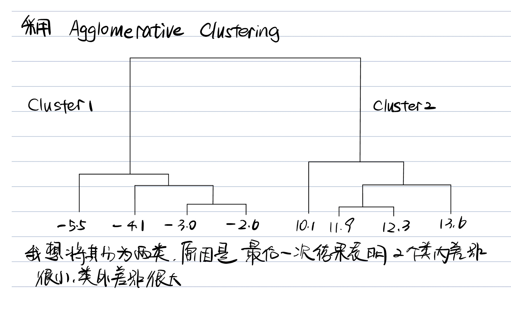
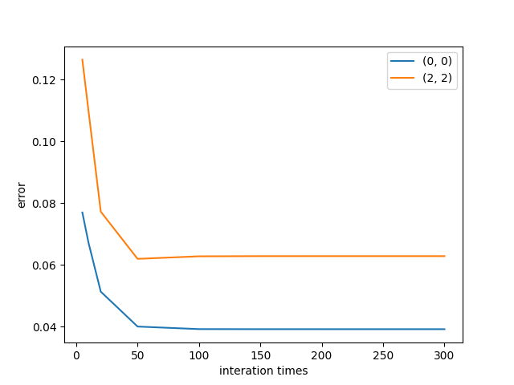
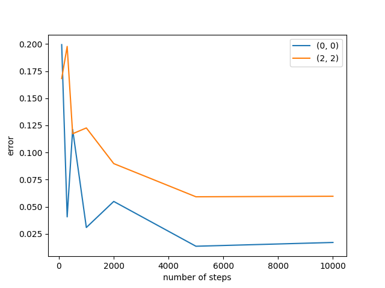
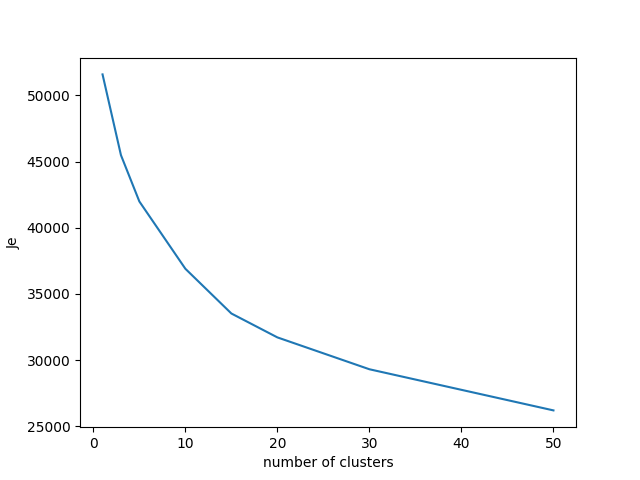

# PRML HW7 Report
### 赵泾源 2020013090

## Problem 1

## Problem 2

### Problem 2 对应的文件是 EM.py

使用sklearn.mixture.GaussianMixture库。该库通过GM算法来计算GMM。思路详见文件EM.py及其注释。对于某一特定超参数，权重，均值，协方差矩阵的值会在程序结尾print出来。prediction error的结果如以下两张图所示。error和step关系图采用2000个数据点，error和number关系图使用500的最大迭代次数。(通过设置极小的tol参数使得模型达到最大迭代次数。)

## Problem 3

### Problem 3 对应的文件是 MNIST.py

### (1)
使用sklearn.cluster.KMeans类进行手写数字识别。绘制得到$J_e$和分类数量的关系如下：

发现"elbow point"大概在10-20之间。

### (2)
对于KMeans方法，每个cluster的均值在文件夹Center_of_KMeans中。起初我将分类数量设置为10，发现分类效果极其不好，正确率在30%上下。之后我仔细思考了拐点的位置并分析了数据集的特性可以发现，实际上对于手写数字，每一种数字都有很多种写法，强行分成10类只会让模型变差(如把9归纳到4，把3和8弄混等等)，因此我在拐点附近适当增加了cluster的数量，同时设置n_init为20来提高得到全局最优的概率。发现在cluster数量为20的时候，多次尝试最优的正确率约为65%左右，而增大至30时正确率就不会再有从10-15， 15-20那样的提升了。

附：分类数量超过10的时候即多个类对应同一个数字。对应方法是对于每个类，遍历0-9十个数字进行预测，找到预测
结果中该类最多的数字，建立该类与该数字的映射关系。

### (3)
尝试EM方法的时候，我将n_components与之前的n_cluster设置为同一数值，平均值储存到了Center_of_Em文件夹中。
其正确率约为60%左右，略差于KMeans。

## 附：以当前目录允许时本report中的图片会随新的运行结果而改变