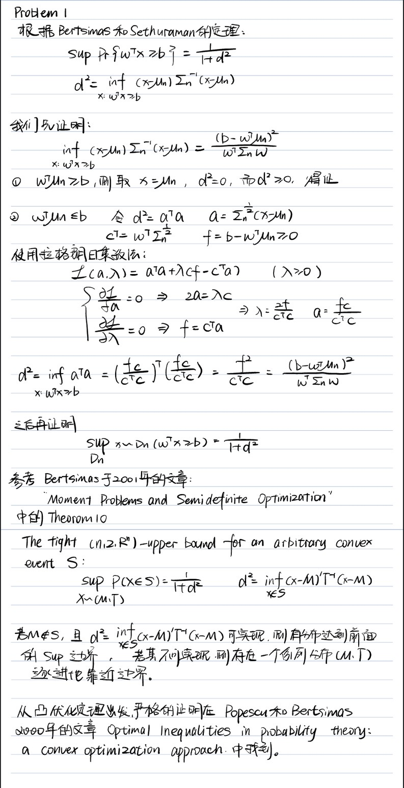
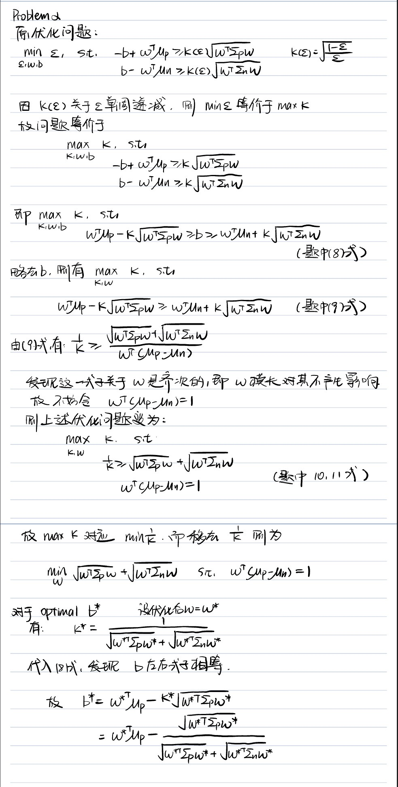
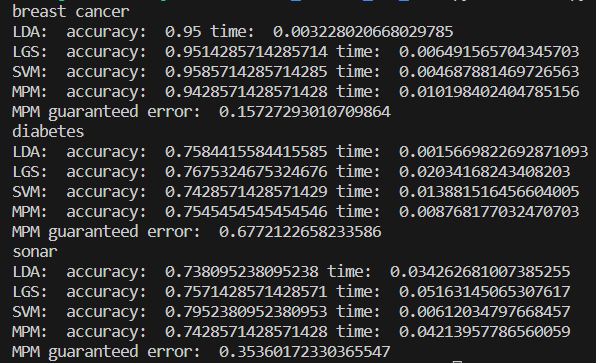
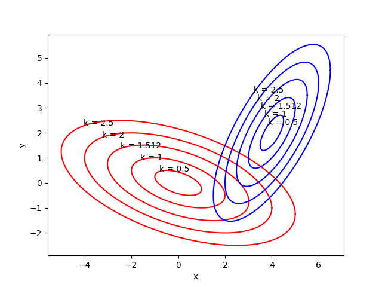
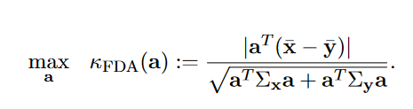
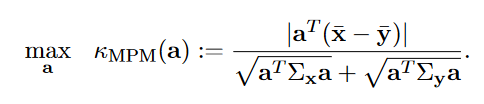

# PRML BIG HW Section1

## Problem 1: 
证明见下图：

## Problem 2:
证明见下图：

## Problem 3:

使用cvxpy库进行SOCP优化问题求解。MPM.py 文件中定义了题中的MPM类，其类函数重载了HW6中其他算法的基本框架，如fit(), predict()等。dataloader.py 文件中定义了数据提取的函数，返回统一的，适配sklearn算法和MPM类算法的数据集。train.py 文件中定义了训练函数。main.py 文件执行整个训练流程。

最终四种算法的结果如下图所示(图中LGS为logistic regression)：

观察这些算法的运行时间课余发现，不同算法运行速度是与数据集密切相关的。对于MPM算法，其速度主要被限制在求cov矩阵(numpy算法)以及SOCP问题求解。

## Problem 4:

椭圆绘制如图：

用插值找解的方法k约为1.512,用MPM方法k也是1.512，二者大体符合。
(椭圆绘制代码文件为 plotEllipsoids.py)

对于MPM和LDA的区别：

对于FDA其需要解决优化问题

这个优化结果对应着两个类别的良好分离和较小的投影方差。但是其能否可以用于计算分类误差却无法确定。

而MPM优化问题：

在理论上，它的目标是最小化最坏分类概率，同时涉及最优的分离方向。但是MPM和FDA均值和协方差组合的方式并不相同。

使用这一思想和MPM及FDA优化得到的K的关系，我们可以像MPM那样给出FDA的泛化误差界限，也给了一个在
不假设高斯分布下确定截距b的方法。

总的来说，Fisher判别本质上是一种辅助分类的特征提取方法，并不专门针对解决分类问题。FDA建立在高计算效率的"分离"上 (用一阶矩和二阶矩表征)。事实上，FDA优化问题的解是通过求解一个广义特征值问题得到的。而另一方面，MPM criterion function函数与FDA criterion function函数在细节上有所不同，但由于二者相似的形式，MPM保留了寻找分离数据方向的直观色彩。