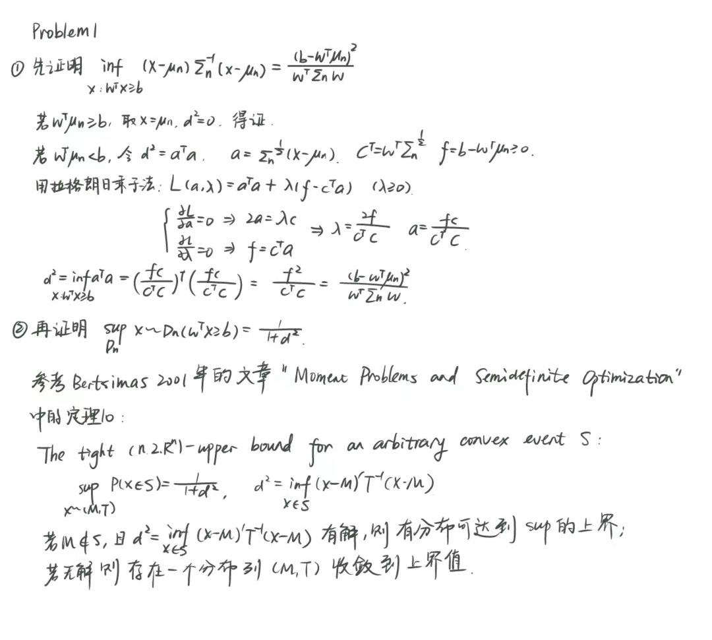
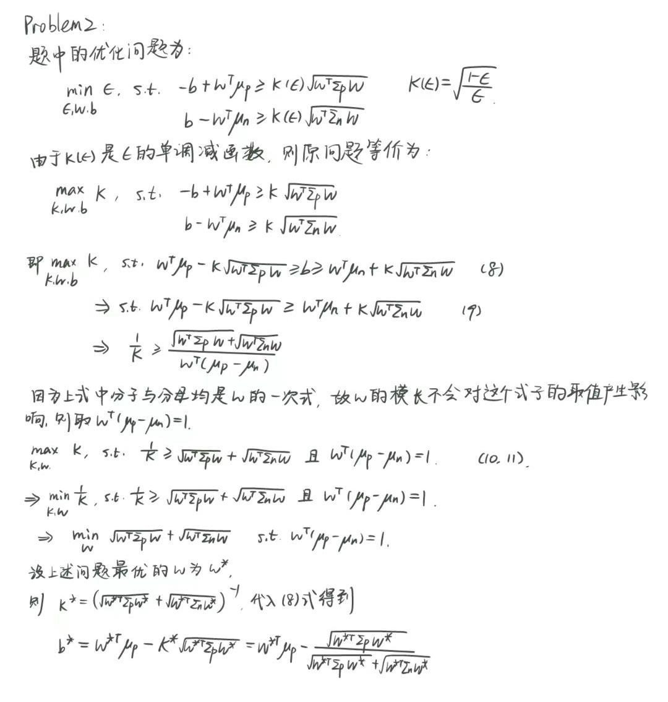
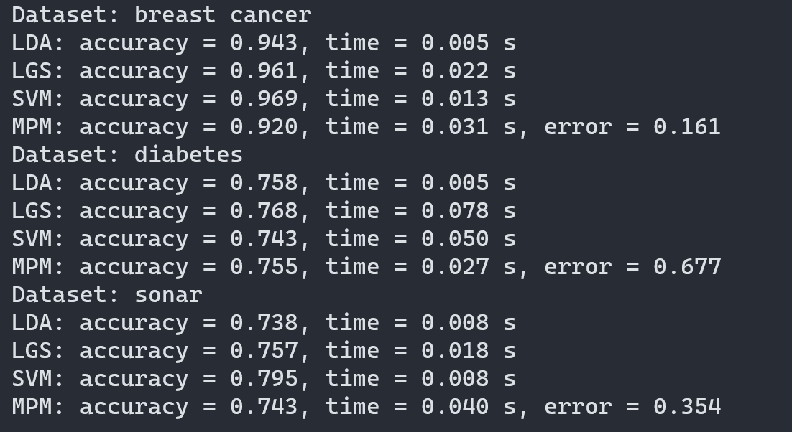
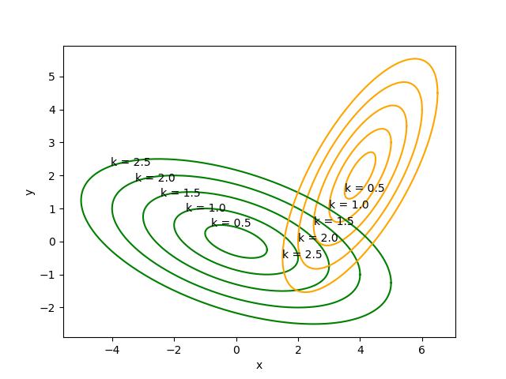

# 模式识别与机器学习 大作业一

胡清茹 2020012996

## Problem1

## Problem2

## Problem3

加载数据，建立模型和训练数据的代码在`MPM.py`中。在MPM模型中使用cvxpy包求解SOCP的优化问题。最终全部模型的结果如下图所示，可以发现平均的MPM保证的误差与原论文中相近，此外不同模型训练的准确率与速度和数据集的性质有关。

## Problem4

MPM模型求解出来的最佳的$$\kappa = 1.51215$$，画出不同$$\kappa$$值下的椭圆图如下图所示，可以看到$$\kappa=1.5$$时最佳与MPM计算得到的结果一致。计算和绘制$$\kappa$$的代码在`plot_elli.py`中。

**MPM和FDA的关系**

MPM和FDA处理的都是线性的二分类问题，但是他们为二分类问题建构的优化目标是不一样的。

MPM的目标是最小化最坏分类概率，同时涉及最优的分离方向，其具体的优化函数为：
$$
\max _a \kappa_{M P M}(\mathbf{a})=\frac{\left|a^T(\bar{x}-\bar{y})\right|}{\sqrt{a^T \Sigma_x a}+\sqrt{a^T \Sigma_y a}}
$$
FDA的目标是最大化类间间距最小化类内区别，其具体的优化函数为：
$$
\max _a \kappa_{F D A}(\mathbf{a})=\frac{\left|a^T(\bar{x}-\bar{y})\right|}{\sqrt{a^T \Sigma_x a+a^T \Sigma_y a}}
$$
FDA本质上是一种辅助分类的特征提取方法，而不是专门针对解决分类问题。 FDA 建立在一阶矩和二阶矩为特征的分离上，是一种有用的直觉并且能满足计算效率的迫切需求。另一方面，MPM 的优化函数是与 FDA 优化函数虽然在细节上有不同，但由于其相似的形式MPM也保留了寻找分离数据方向的直觉。 MPM可以直接解决分类问题，并与FDA具有相似的算法复杂度。

## Acknowledegement

感谢赵泾源同学关于此次大作业的讨论与指导。
